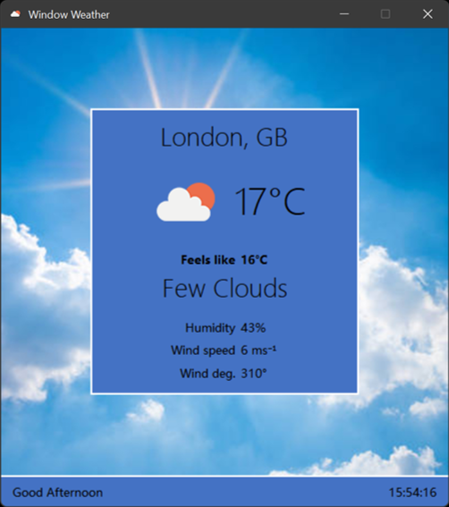

# Window Weather
Window is a Python weather app which uses the OpenWeather API to get current weather updates at your current location.

# Screenshots

# Credits

- Weather information from OpenWeather API (https://openweathermap.org/)
- World Citites data from World Urbanisation Prospects (https://population.un.org/wup/)
